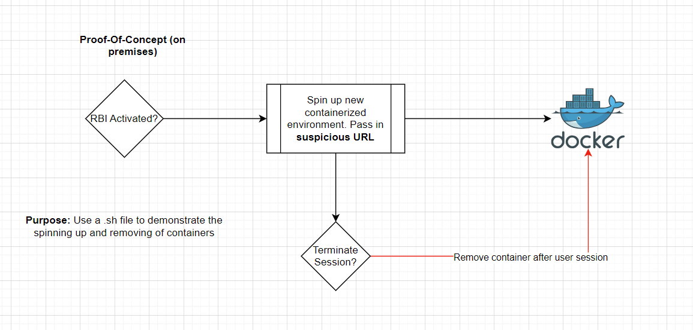

# ShieldedSurf
A security-focused project that aims to protect everyday internet surfers from malicious websites using Remote Browser Isolation (RBI).

Imagine you are surfing the web, and you click on a link. You are familiar with how to spot malicious websites so you are confident in your decision to click that one page. What you are not familiar with is that cyber-threats are evolving, and so to techniques to avoid suspicion.

You click on that link and it downloads something onto your desktop. By the time you notice, it is too late. You have been successfully exploited.

Source: https://www.forbes.com/advisor/education/it-and-tech/cybersecurity-statistics/#Sources
The following source states that at any given time, 4.1 million sites are infected with malware.

It's important to have a service that protects you from online threats, while ensuring your productivity and streamlined day-to-day tasks.

Docker image utilized: jlesage/docker-firefox

# Basic Flow

# Current Progress
I have a bash file that will locally create a remote browser based on the URL from user input.

